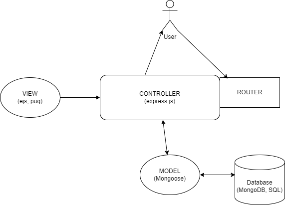

# MVC
## THE MODEL VIEW CONTROLLER SYSTEM DESIGN
----------------------------------------------------

The model-view-controller design pattern is a methodology used in backend applications for JS projects.
It's main ideology is to seperate the concerns of the backend. Similar to seperating the front-end into 
HTML, CSS, and JS files, it provides compactness, modularity, and reusability. The backend can be broken 
down into View components, Controller components, and Model components.  There are several diffferent 
variations to this design pattern in which other components may be added to the overall paradigm.  

### THE MODEL

The Model represents the data and business logic of the application. It encapsulates the data structure, data 
validation, and database interactions. In JavaScript projects, libraries like Mongoose for MongoDB or Sequelize 
for SQL databases are commonly used for modeling data. These libraries provide features for defining schemas (structure
of the database), performing CRUD (create,read,update, delete) operations, and handling relationships between different 
data entities.

### THE VIEW

The View is responsible for presenting the data to the user in a visually appealing manner. In backend JavaScript projects, 
the View is often rendered using templating engines like EJS (Embedded JavaScript), Handlebars, or Pug (formerly known as 
Jade). These templating engines allow developers to generate dynamic HTML pages by embedding JavaScript code within HTML 
markup. For example, EJS allows us to include JavaScript logic directly in our HTML templates, making it easier to pass data 
from the backend to the frontend.

### THE CONTROLLER

The Controller acts as an intermediary between the Model and the View. It receives user inputs, processes them, interacts with 
the Model to retrieve or manipulate data, and then passes the processed data to the View for display. In JavaScript frameworks 
like Express.js, controllers are implemented as route handlers. Express.js provides a simple and flexible way to define routes 
and handle HTTP requests. Controllers in Express.js route incoming requests to the appropriate handler functions, where business 
logic is executed, and responses are sent back to the client.

## A SIMPLE WALKTHROUGH

1. The USER goes to the website and is presented with the home route static view.  The client side JS will 'listen' for inputs from
the user.  Once the client side sends information using HTTP, the router will send the route/method to the controller.  

2. The CONTROLLER will take the incoming information from the route/method and deteremine how the information should be handled.  
It will contact the database to do the appropriate CRUD operation desired.  

3.  If there is information that needs to be rendered dynamically, it will be routed to the VIEW component to be processed and render
the HTML.

4.  The information is then sent back to the user.

## CONCLUSSION

The Model-View-Controller (MVC) design pattern is a powerful architectural pattern for developing backend JavaScript projects. By dividing 
the application into three distinct components – Model, View, and Controller – MVC promotes code organization, modularity, and reusability.

